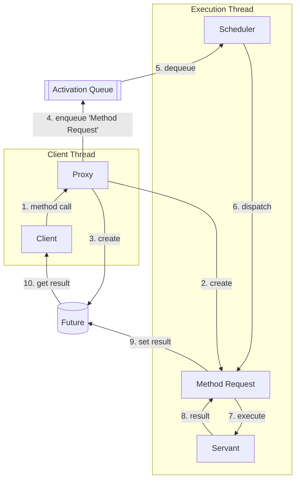
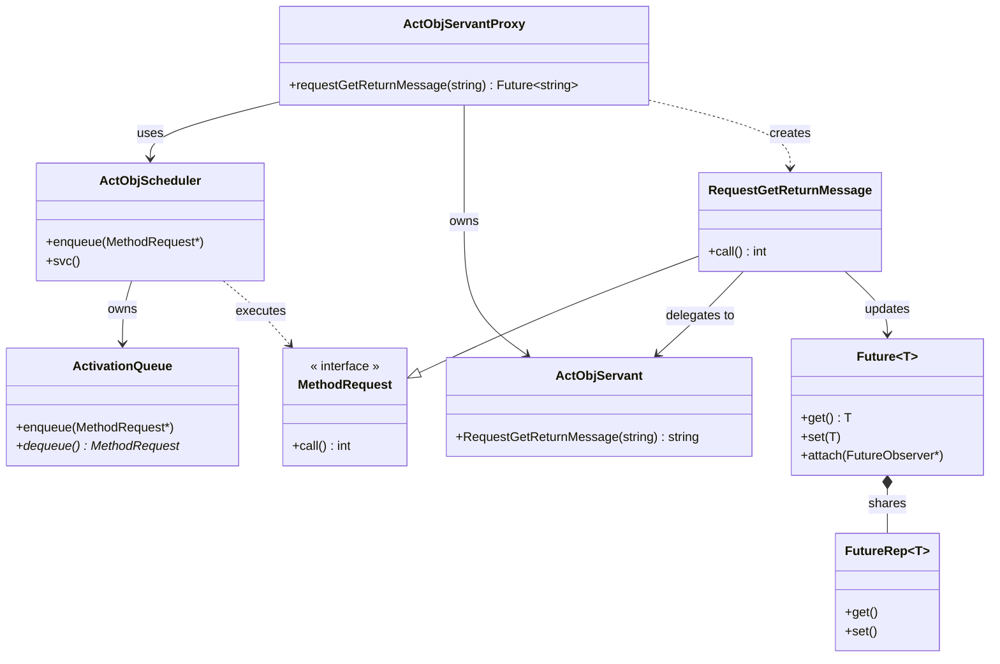
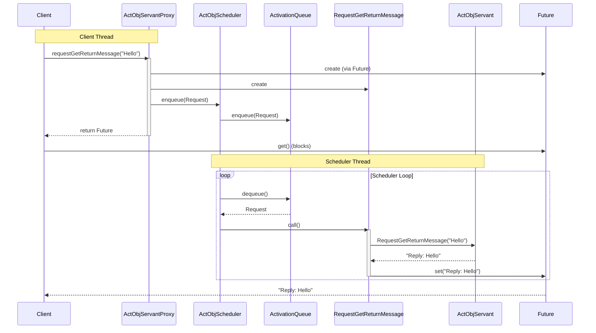
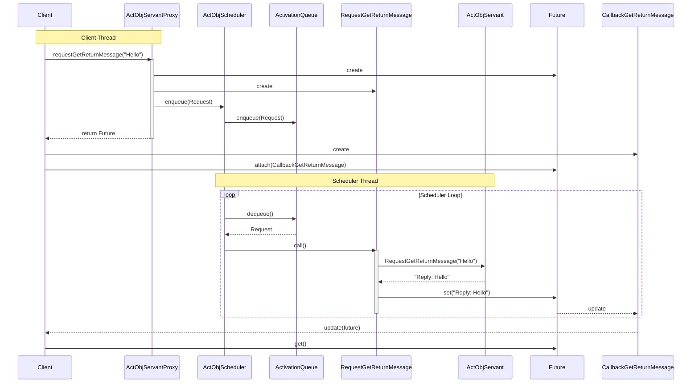

**Table of Contents**
- [Overview](#overview)
- [Active Object pattern](#active-object-pattern)
  - [Background](#background)
  - [Solution](#solution)
  - [Structure](#structure)
- [Simplified version of Implementation](#simplified-version-of-implementation)
  - [Design Choices](#design-choices)
  - [Component Mapping](#component-mapping)
  - [Framework Layer](#framework-layer)
  - [Application Layer](#application-layer)
  - [class diagram](#class-diagram)
  - [sequence diagram](#sequence-diagram)
    - [Use Case: client waits synchronously](#use-case-client-waits-synchronously)
    - [Use Case: Client is triggered by callback asynchronously.](#use-case-client-is-triggered-by-callback-asynchronously)
  - [Directory and file structure](#directory-and-file-structure)


## Overview

This post explores the **Active Object pattern** [[POSA2](/references/post-references)] through a **simplified** implementation inspired by the [Adaptive Communication Environment (ACE)](https://www.dre.vanderbilt.edu/~schmidt/ACE.html). 

My goal is to share what I learned by building a simplified implementation.

## Active Object pattern

The **Active Object pattern** [[POSA2](/references/post-references)], also known as Concurrent Object, decouples the method execution from the method invocation to enhance concurrency and simplify the synchronized access to the objects that resides in different thread.

### Background
In multi-thread system, Objects run concurrently and we have to synchronize access to their methods and data if objects are shared and modified by multiple threads. In this case the following constraints should be considered.
- the Processing-intensive method that are called concurrently on an object must not block the entire process.
- Synchronized access to shared objects should be easy to program.
- Applications should be designed to transparently leverage the parallel processing capabilities available on the hardware/software platform.

### Solution
- Decouple method invocation on the object from method execution.
- Method invocation should be occur on the client's thread and it's execution should occurs in a separated thread where servant object runs.
- From the client point of view, it should be like a calling ordinary functions.

### Structure

The active object consists of the following six components

+ **Proxy**: Provides an interface that the clients invokes to execute a method of the active object resides in different thread.
+ **Method Request Class**: Defines an interface for executing method in active object. it is subclassed to create concrete method request class.
+ **Activation list**: A Proxy insert created concrete method request object into activation list, the inserted method request dequeued from the thread where active object resides and executed.
+ **Scheduler**: Runs in active object's thread. it dequeue the queued instance of method request from the activation list and executes the method.
+ **Servant**: Defines the behavior and state modeled by an active object. The method implemented by the servant correspond to the interface provided by the proxy. it's method is executed by scheduler in the thread where the scheduler runs. 
+ **Future**: The client receives a object of future after invoke the interface, The client get the result of the method invocation via the future once the servant finishes executing the method. client gets result data by synchronous wait ( blocked wait ) or asynchronous callback.





## Simplified version of Implementation

The simplified **Active Object pattern** and example application is implemented to better understand how the pattern works and how it is designed. The source is in my [Git repository](https://github.com/yjung93/study_reactor_1_0).  

### Design Choices
This version keeps the core architectural ideas from ACE while intentionally skipping production-level complexity. Unlike the full ACE implementation which uses templates for flexible threading policies, this version hardcodes the thread management to keep the code readable and focused on the pattern mechanics.

### Component Mapping
To implement this pattern, I mapped the standard Active Object components to the following C++ classes:

| Pattern Role | My Implementation Class |
| :--- | :--- |
| **Proxy** | `ActObjServantProxy` |
| **Scheduler** | `ActObjScheduler` |
| **Servant** | `ActObjServant` |
| **Method Request** | `RequestGetReturnMessage` (Concrete) |
| **Activation List** | `ActivationQueue` |

### Framework Layer

+ **Method Request Class**: 
  + **Implementation**: An abstract base class.
  + **Interface**: Defines a pure virtual `call()` method that must be implemented by concrete request classes to execute the specific logic.
+ **ActivationQueue**: 
  + **Implementation**: A thread-safe queue wrapper.
  + **Logic**: Uses standard mutexes and condition variables to safely enqueue requests from the client thread and dequeue them in the scheduler thread.
+ **Future**: 
  + **Implementation**: A template class that holds the result of an asynchronous operation.
  + **Logic**: Allows the client to retrieve the result via `get()` (synchronous blocking wait) or `attach()` (asynchronous callback).

### Application Layer

+ **ActObjServantProxy**: 
  + **Implementation**: The client-facing API.
  + **Logic**: Converts method calls (e.g., `requestGetReturnMessage`) into `MethodRequest` objects, enqueues them into the `ActObjScheduler`, and immediately returns a `Future<T>` to the client.
  
+ **ActObjScheduler**: 
  + **Implementation**: Inherits from the `Task` class to manage the worker thread.
  + **Logic**: The `svc()` method runs the event loop, continuously dequeuing requests from the `ActivationQueue` and invoking their `call()` method.

+ **ActObjServant**: 
  + **Implementation**: The business logic provider.
  + **Logic**: Contains the actual implementation of the methods (e.g., `RequestGetReturnMessage`) which are executed by the Scheduler in its thread.

+ **RequestGetReturnMessage**:
  + **Implementation**: A concrete implementation of `MethodRequest`.
  + **Logic**: In its `call()` method, it invokes the corresponding method on the `ActObjServant`, captures the return value, and sets it on the `Future` to wake up waiting clients.

### class diagram



### sequence diagram
#### Use Case: client waits synchronously


#### Use Case: Client is triggered by callback asynchronously.


### Directory and file structure
Related source files:

```bash
├── applications
│   ├── example_active_object
│   │   ├── ActObjAcceptor.cpp
│   │   ├── ActObjAcceptor.hpp
│   │   ├── ActObjClient.cpp
│   │   ├── ActObjClient.hpp
│   │   ├── ActObjMain.cpp
│   │   ├── ActObjMain.hpp
│   │   ├── ActObjMethodCallback.cpp
│   │   ├── ActObjMethodCallback.hpp
│   │   ├── ActObjMethodRequests.cpp
│   │   ├── ActObjMethodRequests.hpp
│   │   ├── ActObjScheduler.cpp
│   │   ├── ActObjScheduler.hpp
│   │   ├── ActObjServant.cpp
│   │   ├── ActObjServant.hpp
│   │   ├── ActObjServantProxy.cpp
│   │   ├── ActObjServantProxy.hpp
│   │   ├── MainClient.cpp
│   │   └── MainServer.cpp
├── framework
│   ├── active_object
│   │   └── 1_0
│   │       ├── ActivationQueue.cpp
│   │       ├── ActivationQueue.hpp
│   │       ├── Future.cpp
│   │       ├── Future.hpp
│   │       ├── MethodRequest.cpp
│   │       └── MethodRequest.hpp
│   └── task
│       └── 1_0
│           ├── Task.cpp
│           └── Task.hpp

```
