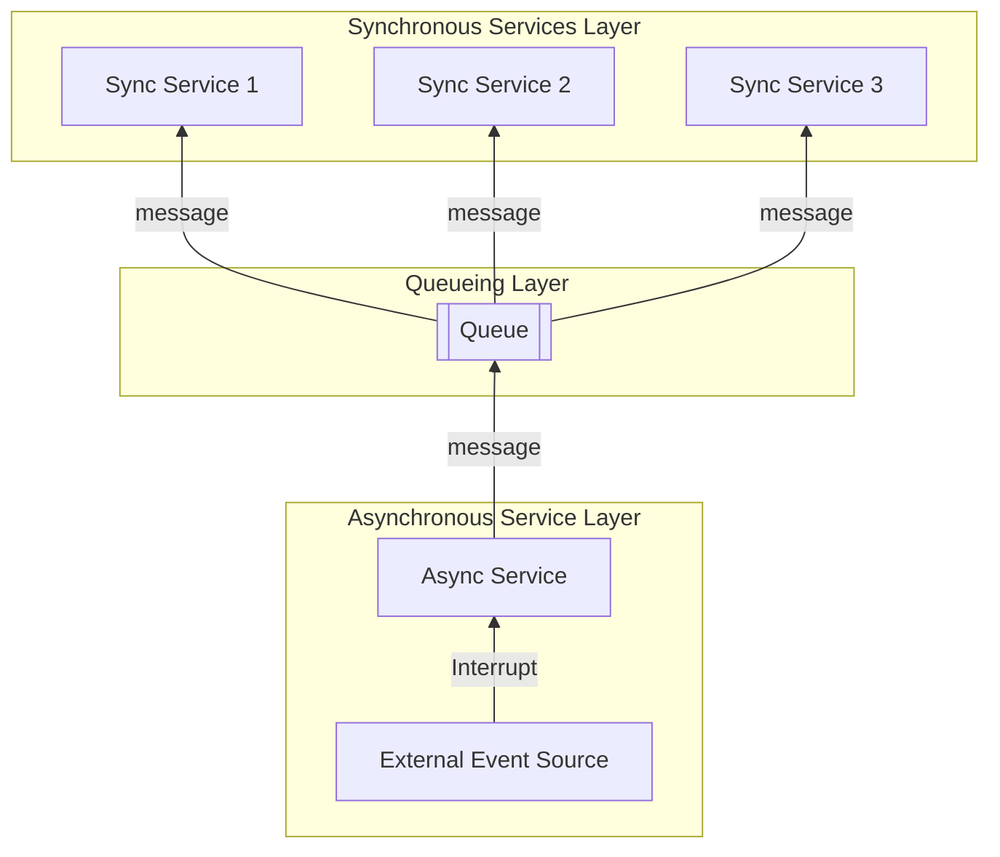
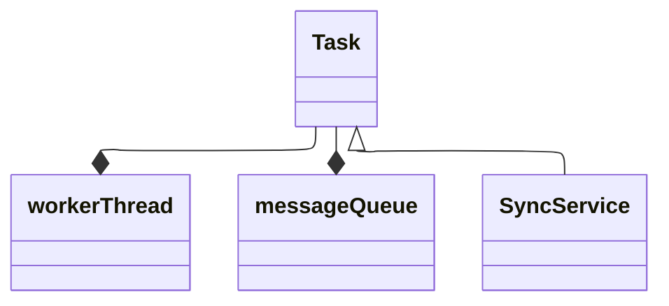
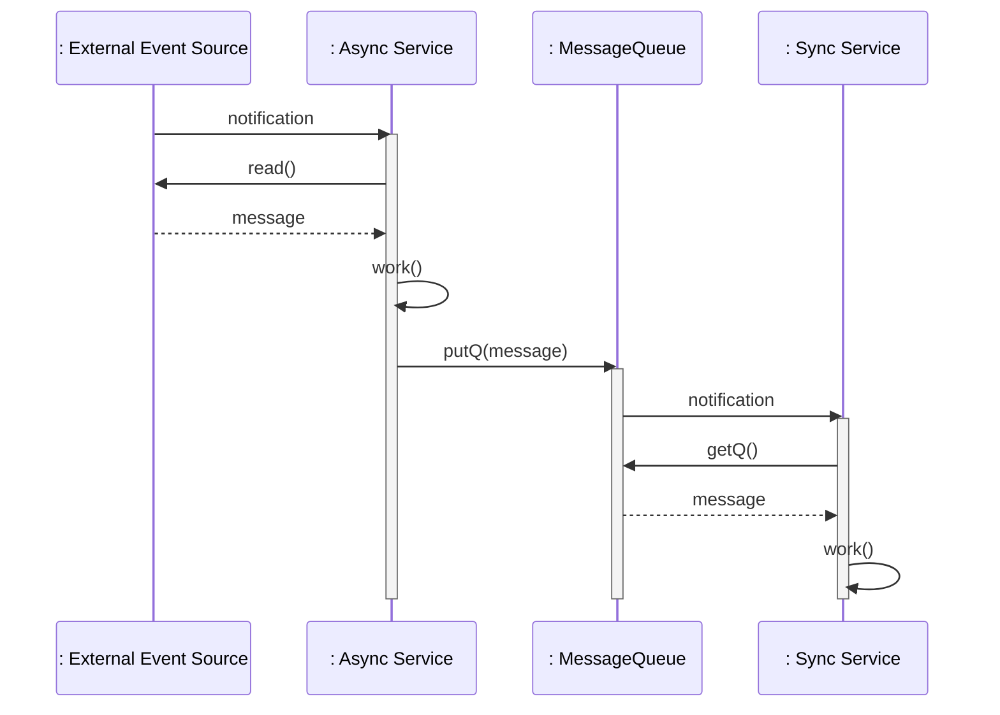
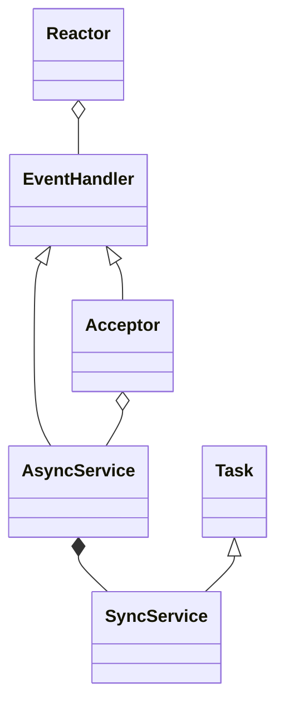
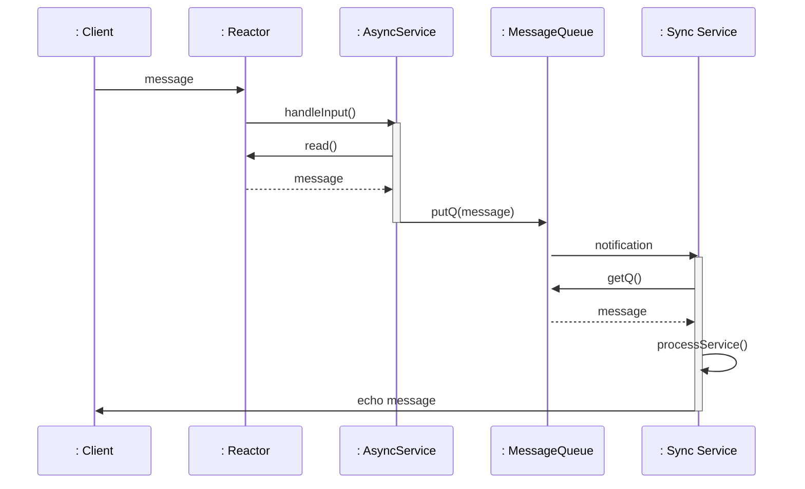
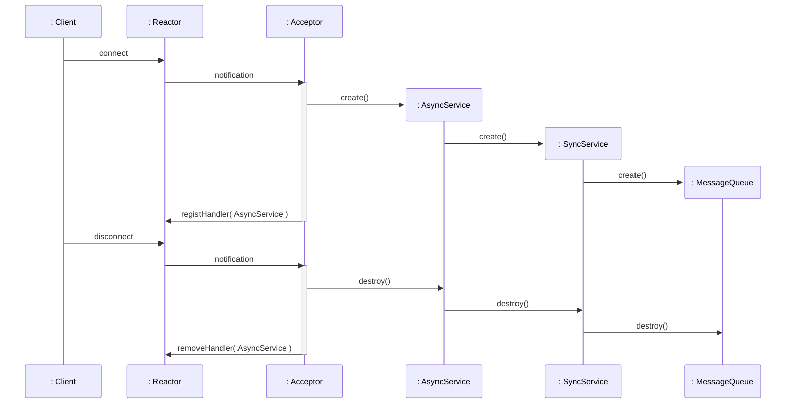

**Table of Contents**
- [Overview](#overview)
  - [Structure](#structure)
- [Simplified Task framework implementation](#simplified-task-framework-implementation)
  - [class diagram](#class-diagram)
  - [sequence diagram](#sequence-diagram)
- [Example Application using Task framework](#example-application-using-task-framework)
  - [Server application](#server-application)
    - [Accepror](#accepror)
    - [AsyncService](#asyncservice)
    - [SyncService](#syncservice)
  - [class diagram](#class-diagram-1)
  - [Sequence Diagram](#sequence-diagram-1)
    - [Interoperation between Async and Sync service layer](#interoperation-between-async-and-sync-service-layer)
    - [Life Cycle of Async/Sync Service component](#life-cycle-of-asyncsync-service-component)
  - [Directory and file structure](#directory-and-file-structure)


## Overview
The **Half-Sync/Half-Async pattern** [[POSA2](/references/post-references)] simplifies programming in concurrent systems by decoupling asynchronous and synchronous service processing.


This post explores this pattern through a **simplified** implementation inspired by the [Adaptive Communication Environment (ACE)](https://www.dre.vanderbilt.edu/~schmidt/ACE.html). The design pattern is applied to the **Task Framework** [[SH03](/references/post-references)] of ACE.

My goal is to share what I learned by building a simplified implementation.


### Structure
This pattern is organized into three layers:

+ **Asynchronous (or reactive) processing Layer**
+ **Synchronous service processing Layer**
+ **Message Queue between Async. and Sync. layer**



## Simplified Task framework implementation
The simplified **Task framework** is implemented to better understand how the pattern works and how it fits into a layered design. The source is in my [Git repository](https://github.com/yjung93/study_reactor_1_0).  

This version keeps the core architectural ideas from ACE while intentionally skipping production-level complexity.

The framework consists of the following components:
- **Task class**
  - Base class of synchronous services. It embeds a message queue and a worker thread, enabling the concrete class to perform synchronous layer services.  
- **Message Queue**
  - The asynchronous layer passes messages through this queue to the synchronous layer service.   
- **Worker Thread**
  - The thread on which the synchronous service runs. It wakes up when it receives a message from the asynchronous service and performs the synchronous application service.
- **Sync service**
  - Concrete subclass of `Task`. It receives messages from the asynchronous layer and performs synchronous application services.

### class diagram


### sequence diagram



## Example Application using Task framework

### Server application
- Demonstration server that waits for client connections, accepts them, and echoes messages received from clients.
- Consists of `Acceptor` and `AsyncService` running on the main thread, and `SyncService` running on a separate thread.

#### Accepror
- Accepts incoming connections and creates `AsyncService` and `SyncService` objects when a connection is established.
- Registers the `AsyncService` object with the `Reactor` so it can receive callback events when a message arrives from a client.

#### AsyncService
- Receives external events from the `Reactor` and forwards the corresponding messages to `SyncService` via the message queue.

#### SyncService
- Concrete subclass of the `Task` class.
- Processes synchronous services on a separate, independent thread.

### class diagram


### Sequence Diagram

#### Interoperation between Async and Sync service layer



#### Life Cycle of Async/Sync Service component




### Directory and file structure
Related source files:

```bash
├── applications
│   ├── example_half-sync_half-async
│   │   ├── Acceptor.cpp
│   │   ├── Acceptor.hpp
│   │   ├── AsyncService.cpp
│   │   ├── AsyncService.hpp
│   │   ├── MainClient.cpp
│   │   ├── MainServer.cpp
│   │   ├── SyncService.cpp
│   │   └── SyncService.hpp
├── framework
│   ├── reactor
│   │   └── 1_0
│   │       ├── EventHandler.cpp
│   │       ├── EventHandler.hpp
│   │       ├── Reactor.cpp
│   │       └── Reactor.hpp
│   └── task
│       └── 1_0
│           ├── Task.cpp
│           └── Task.hpp

```
