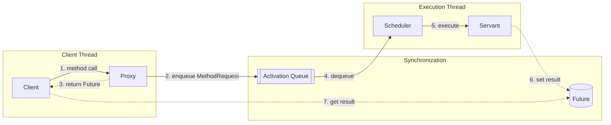
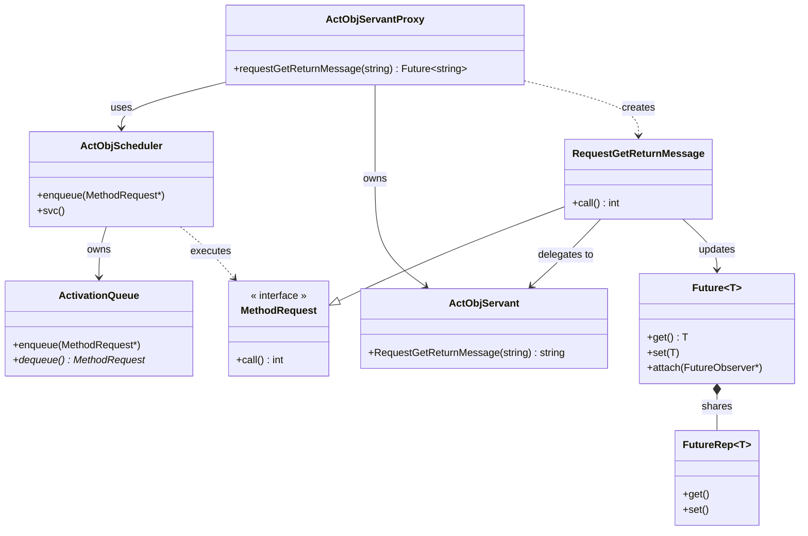
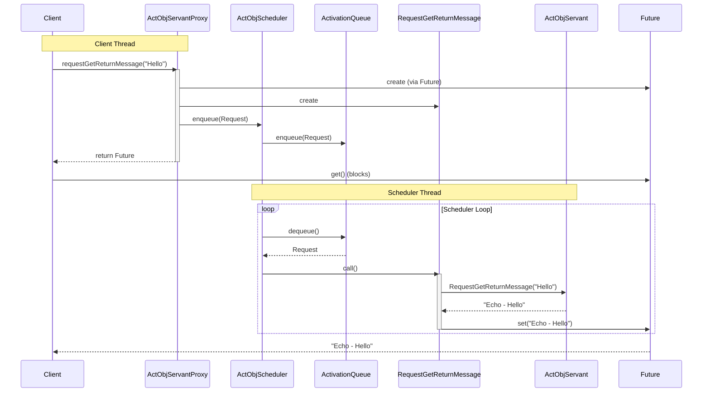
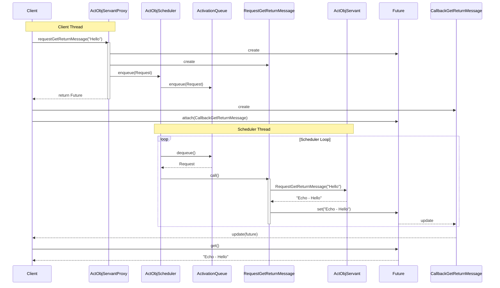

**Table of Contents**
- [Overview](#overview)
- [Active Object pattern](#active-object-pattern)
  - [Background](#background)
  - [Solution](#solution)
  - [Structure](#structure)
- [Simplified version of Implementation](#simplified-version-of-implementation)
  - [Design Choices](#design-choices)
  - [Component Mapping](#component-mapping)
  - [Framework Layer](#framework-layer)
  - [Application Layer](#application-layer)
  - [Class diagram](#class-diagram)
  - [Sequence diagram](#sequence-diagram)
    - [Use Case: client waits synchronously](#use-case-client-waits-synchronously)
    - [Use Case: Client is triggered by callback asynchronously.](#use-case-client-is-triggered-by-callback-asynchronously)
  - [Directory and file structure](#directory-and-file-structure)


## Overview

This post explores the **Active Object pattern** [[POSA2](/references/post-references)] through a **simplified** implementation inspired by the [Adaptive Communication Environment (ACE)](https://www.dre.vanderbilt.edu/~schmidt/ACE.html). 

My goal is to share what I learned by building this simplified implementation.

## Active Object pattern

The **Active Object pattern** [[POSA2](/references/post-references)], also known as Concurrent Object, decouples method execution from method invocation to enhance concurrency and simplify synchronized access to objects that reside in different threads.

### Background
In a multi-threaded system, objects run concurrently, and we must synchronize access to their methods and data if they are shared and modified by multiple threads. In this case, the following constraints should be considered:
- Processing-intensive methods that are called concurrently on an object must not block the entire process.
- Synchronized access to shared objects should be easy to program.
- Applications should be designed to transparently leverage the parallel processing capabilities available on the hardware/software platform.

### Solution
Decouple method invocation on the object from method execution.
- Method invocation should occur on the client's thread, while its execution should occur in a separate thread where the servant object runs.
- From the client's point of view, it should be like calling ordinary functions.
  
In Detail:
- The Proxy provides the API of the active object to be invoked, and the Servant provides the business logic of the active object to be executed.
- The Proxy runs on the client thread, while the Servant runs in a separate thread.

### Structure

The Active Object pattern consists of the following six components:

+ **Proxy**: Provides an interface that clients invoke to execute a method of the active object residing in a different thread.
+ **Method Request Class**: Defines an interface for executing methods in the active object. It is subclassed to create concrete method request classes.
+ **Activation List**: The Proxy inserts created concrete method request objects into the activation list. These requests are then dequeued and executed by the thread where the active object resides.
+ **Scheduler**: Runs in the active object's thread. It dequeues the queued method requests from the activation list and executes them.
+ **Servant**: Defines the behavior and state modeled by an active object. The methods implemented by the servant correspond to the interface provided by the proxy. Its methods are executed by the scheduler in the thread where the scheduler runs. 
+ **Future**: The client receives a Future object after invoking the interface. The client obtains the result of the method invocation via the Future once the servant finishes executing the method. The client can retrieve the result data by a synchronous wait (blocked wait) or an asynchronous callback.



## Simplified version of Implementation

This simplified **Active Object pattern** implementation and example application were created to better understand how the pattern works and how it is designed. The source is in my [Git repository](https://github.com/yjung93/study_reactor_1_0).  

### Design Choices
This version keeps the core architectural ideas from ACE while intentionally skipping production-level complexity. For example, unlike the full ACE implementation which applies priority when executing methods in the active list, this version uses a simple FIFO strategy for executing methods.

The following frameworks are used as infrastructure for this implementation:
- [Reactor framework](/design%20pattern%20-%20ace%20framework/post-reactor/)
- [Task framework](/design%20pattern%20-%20ace%20framework/post-halfsync-halfasync/) 

### Component Mapping
To implement this pattern, I mapped the standard Active Object components to the following C++ classes:

| Pattern Role | My Implementation Class |
| :--- | :--- |
| **Proxy** | `ActObjServantProxy` |
| **Scheduler** | `ActObjScheduler` |
| **Servant** | `ActObjServant` |
| **Method Request** | `RequestGetReturnMessage` (Concrete) |
| **Activation List** | `ActivationQueue` |

### Framework Layer

+ **Method Request Class**: 
  + **Implementation**: An abstract base class.
  + **Interface**: Defines a pure virtual `call()` method that must be implemented by concrete request classes to execute the specific logic.
+ **ActivationQueue**: 
  + **Implementation**: A thread-safe queue wrapper.
  + **Logic**: Uses standard mutexes and condition variables to safely enqueue requests from the client thread and dequeue them in the scheduler thread.
+ **Future**: 
  + **Implementation**: A template class that holds the result of an asynchronous operation.
  + **Logic**: Allows the client to retrieve the result via `get()` (synchronous blocking wait) or `attach()` (asynchronous callback).

### Application Layer
+ **ActObjServantProxy**: 
  + **Implementation**: The client-facing API.
  + **Logic**: Converts method calls (e.g., `requestGetReturnMessage`) into `MethodRequest` objects, enqueues them into the `ActObjScheduler`, and immediately returns a `Future<T>` to the client.
  
+ **ActObjScheduler**: 
  + **Implementation**: Inherits from the `Task` class to manage the worker thread.
  + **Logic**: The `svc()` method runs the event loop, continuously dequeuing requests from the `ActivationQueue` and invoking their `call()` method.

+ **ActObjServant**: 
  + **Implementation**: The business logic provider.
  + **Logic**: Contains the actual implementation of the methods (e.g., `RequestGetReturnMessage`) which are executed by the Scheduler in its thread.

+ **RequestGetReturnMessage**:
  + **Implementation**: A concrete implementation of `MethodRequest`.
  + **Logic**: In its `call()` method, it invokes the corresponding method on the `ActObjServant`, captures the return value, and sets it on the `Future` to wake up waiting clients.

### Class diagram



### Sequence diagram

#### Use Case: client waits synchronously



#### Use Case: Client is triggered by callback asynchronously.


### Directory and file structure
Related source files:

```bash
├── applications
│   ├── example_active_object
│   │   ├── ActObjAcceptor.cpp
│   │   ├── ActObjAcceptor.hpp
│   │   ├── ActObjClient.cpp
│   │   ├── ActObjClient.hpp
│   │   ├── ActObjMain.cpp
│   │   ├── ActObjMain.hpp
│   │   ├── ActObjMethodCallback.cpp
│   │   ├── ActObjMethodCallback.hpp
│   │   ├── ActObjMethodRequests.cpp
│   │   ├── ActObjMethodRequests.hpp
│   │   ├── ActObjScheduler.cpp
│   │   ├── ActObjScheduler.hpp
│   │   ├── ActObjServant.cpp
│   │   ├── ActObjServant.hpp
│   │   ├── ActObjServantProxy.cpp
│   │   ├── ActObjServantProxy.hpp
│   │   ├── MainClient.cpp
│   │   └── MainServer.cpp
├── framework
│   ├── active_object
│   │   └── 1_0
│   │       ├── ActivationQueue.cpp
│   │       ├── ActivationQueue.hpp
│   │       ├── Future.cpp
│   │       ├── Future.hpp
│   │       ├── MethodRequest.cpp
│   │       └── MethodRequest.hpp
│   └── task
│       └── 1_0
│           ├── Task.cpp
│           └── Task.hpp

```
