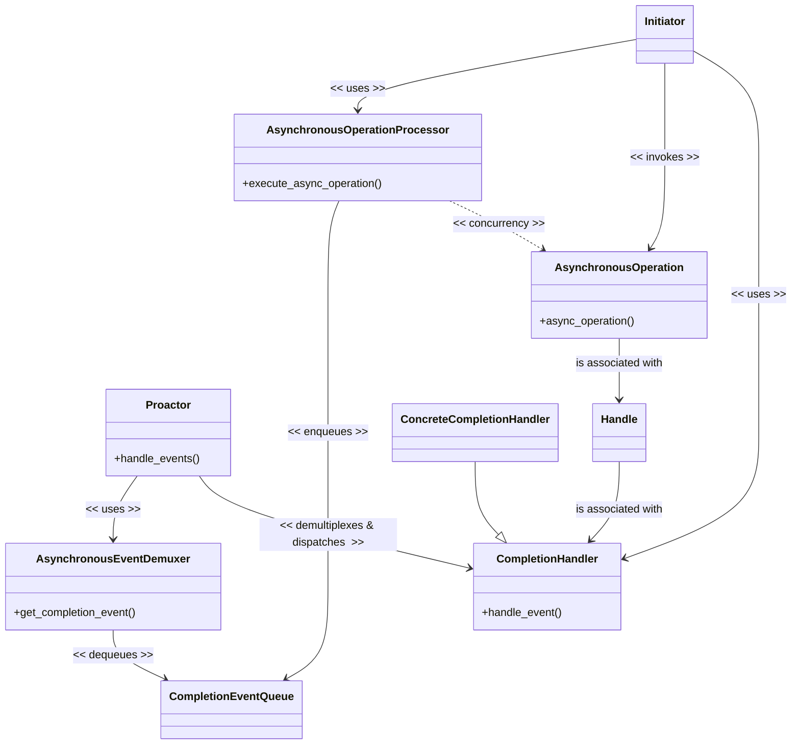
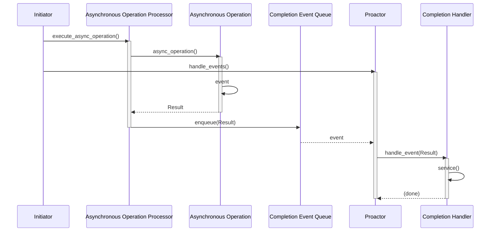
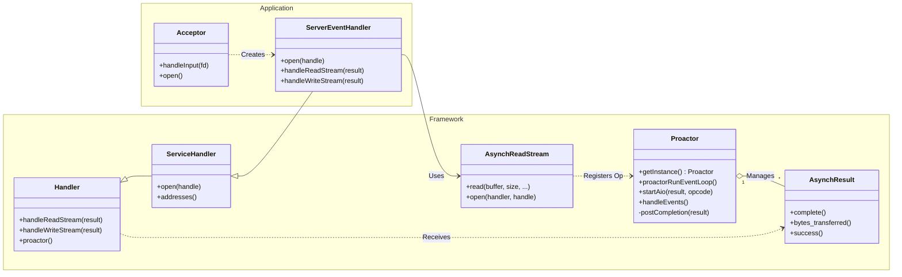
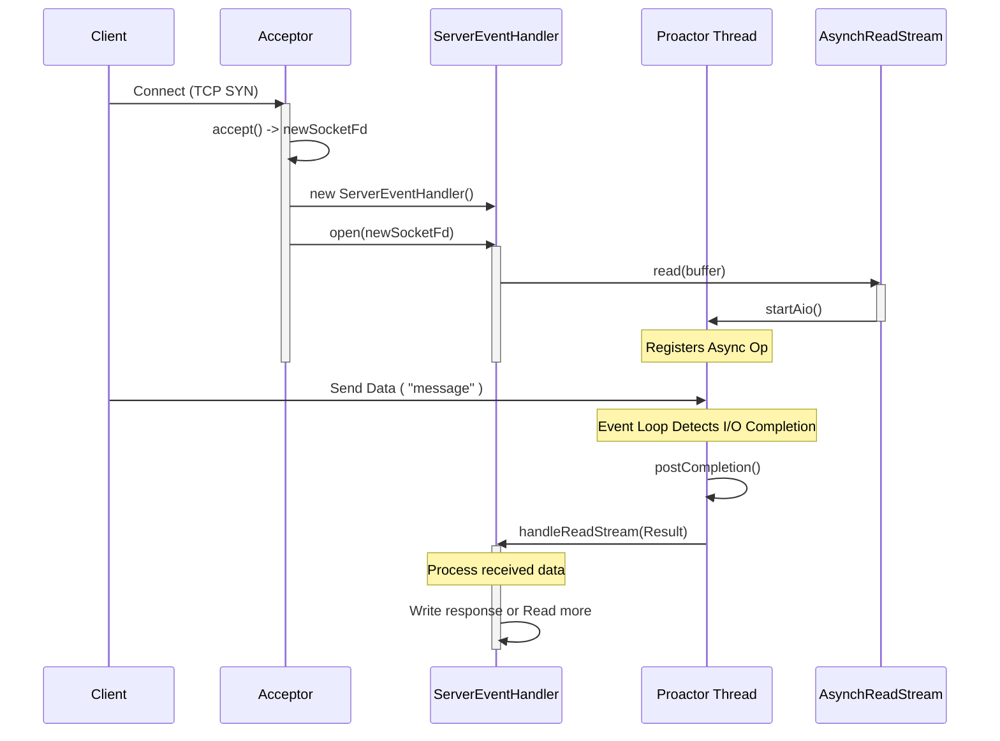
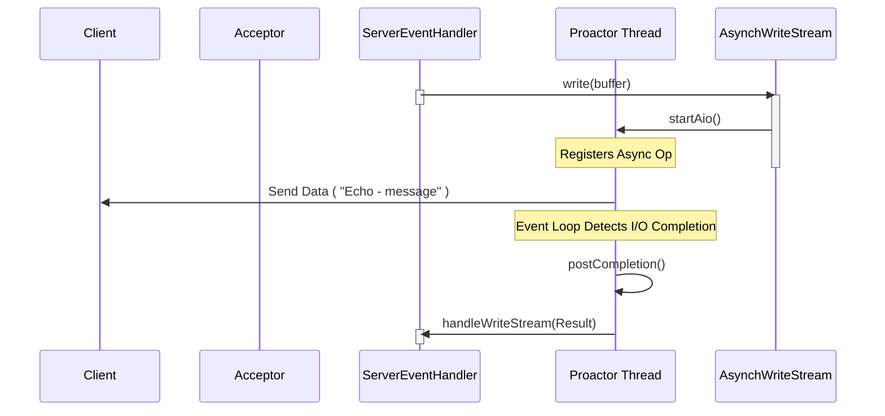

**Table of Contents**
- [Overview](#overview)
- [Proactor pattern](#proactor-pattern)
  - [Background](#background)
  - [Solution](#solution)
  - [Structure](#structure)
    - [Class diagram](#class-diagram)
    - [Dynamic](#dynamic)
- [Simplified version of Implementation](#simplified-version-of-implementation)
  - [Design Choices](#design-choices)
  - [Component Mapping](#component-mapping)
  - [Framework Layer](#framework-layer)
  - [Application Layer](#application-layer)
  - [Class diagram](#class-diagram-1)
  - [Sequence diagram](#sequence-diagram)
  - [Directory and file structure](#directory-and-file-structure)


## Overview

This post explores the **Proactor pattern** [[POSA2](/references/post-references)] through a **simplified** implementation inspired by the [Adaptive Communication Environment (ACE)](https://www.dre.vanderbilt.edu/~schmidt/ACE.html). 

My goal is to share what I learned by building this simplified implementation.

## Proactor pattern

The **Proactor pattern** [[POSA2](/references/post-references)] provides an event-driven framework for efficiently handling the initiation of asynchronous operations—which are potentially long-duration—and processing their completion. It offers the performance benefits of concurrency without the complexity downsides often associated with concurrent application design.

### Background
The performance of event-driven applications, particularly server applications in distributed systems, can be improved when requests are processed asynchronously instead of using synchronous I/O APIs that block the thread.
When processing requests asynchronously, the triggered completion event must be demultiplexed and dispatched to the appropriate component for handling.

To make this approach effective, the following requirements must be met:
- Process multiple completion events in parallel without allowing long-duration processes to block others.
- Maximize throughput by avoiding unnecessary context switching, synchronization overhead, and data movement across CPUs.
- Allow new or improved services to integrate with existing event demultiplexing/dispatching mechanisms with minimal effort.
- Keep application code largely insulated from multi-threading and synchronization complexity.

### Solution
- Split the application into two parts:
  - **Long duration operation**: Executes the long-duration operation asynchronously.
  - **Completion handlers**: Processes the result of the operation when completed.
- Integrate demultiplexing of the completion event with dispatching events to the corresponding component's completion event handler.
- Decouple demultiplexing and dispatching operations from the application-specific completion handling implementation.

### Structure

The Proactor pattern consists of the following participants:
- **Handle**: Identifies entities such as network connections or open files. It is provided by the Operating System.
- **Asynchronous Operations**: Operations used by the application. These are typically long-duration operations, such as reading/writing data asynchronously via a socket.
- **Completion Handler**: An interface that provides a completion method hook associated with an asynchronous operation. The application implements a concrete handler to define application-specific completion logic.
- **Concrete Completion Handlers**: Specializes the Completion Handler.
- **Asynchronous Operation Processor**: Invokes asynchronous operations, which are often provided by the OS kernel. Upon operation completion, a completion event is triggered and dispatched to the corresponding completion handler.
- **Completion Event Queue**: The completion event is inserted into this queue and waits until it is demultiplexed and dispatched to the corresponding completion handler.
- **Asynchronous Event Demultiplexer**: Waits for completed events to be inserted into the completion event queue, then returns them to the caller and removes them from the queue.
- **Proactor**: Provides an event loop for waiting and fetching events from the asynchronous event demultiplexer. Once a completion event is fetched, it dispatches the event to the corresponding completion handler's event hook method.
- **Initiator**: An entity within the application that invokes asynchronous operations and often acts as a completion handler.

#### Class diagram


#### Dynamic




## Simplified version of Implementation


### Design Choices
This version keeps the core architectural ideas from ACE while intentionally skipping production-level complexity. For example, unlike the full ACE implementation which applied Factory and Bridge design patterns to support multiple platforms, this version supports only the POSIX platform and omits all Factory-related structures.

The following frameworks are used as infrastructure for this implementation:
- [Reactor framework](/design%20pattern%20-%20ace%20framework/post-reactor/)


### Component Mapping
To implement this pattern, I mapped the Proactor pattern components to the following C++ classes and associated OS kernel services:

| Pattern Role | Implementation Class/OS Kernel service |
| :--- | :--- |
| **Handle** | `I/O file descriptor` |
| **Asynchronous Operations** | `POSIX.4 Asynchronous I/O` |
| **Completion Handler** | `Handler/ServiceHandler` |
| **Concrete Completion Handlers** | `ServerEventHandler` |
| **Asynchronous Operation Processor** | `POSIX.4 Asynchronous I/O` |
| **Completion Event Queue** | `POSIX.4 Asynchronous I/O` |
| **Asynchronous Event Demultiplexer** | `POSIX.4 Asynchronous I/O` |
| **Proactor** | `Proactor` |
| **Initiator** | `AsynchReadStream/AsynchWriteStream` |


### Framework Layer

The Core components of the Proactor framework are:

-   **Proactor**: The singleton component that manages the event loop (`proactorRunEventLoop`). It processes asynchronous operations, handles completion events, and dispatches them to the appropriate handlers.
-   **Handler**: An abstract base class for application-defined event handlers. It defines virtual methods like `handleReadStream` and `handleWriteStream` to process operation completions.
-   **ServiceHandler**: Extends `Handler` to support connection initialization (`open`).
-   **AsynchResult**: Represents the result of an asynchronous operation. It contains the status, bytes transferred, and acts as a carrier for the completion callback to the `Handler`.
-   **AsynchReadStream / AsynchWriteStream**: Factory classes used by applications to initiate asynchronous read and write operations. They register the request with the `Proactor`.
-   
### Application Layer

The example application demonstrates a hybrid approach where:
-   **Acceptor**: Uses the **Reactor** pattern to synchronously listen for and accept new TCP connections. Upon acceptance, it creates a `ServerEventHandler` and hands over the new socket to the Proactor framework.
-   **ServerEventHandler**: A concrete `ServiceHandler` that manages the lifecycle of a client connection. It initiates asynchronous reads and writes using `AsynchReadStream` and `AsynchWriteStream`.
  
### Class diagram

The following diagram illustrates the relationship between the Proactor framework classes and the application classes.



### Sequence diagram

- The sequence below depicts the flow of a new client connection and process of received data



- The sequence below continues from the diagram above, where ServerEventHandler writes response data to the client.




### Directory and file structure
Related source files:

```bash

├── applications
│   ├── example_proactor
│   │   ├── Acceptor.cpp
│   │   ├── Acceptor.hpp
│   │   ├── MainClient.cpp
│   │   ├── MainServer.cpp
│   │   ├── ServerEventHandler.cpp
│   │   └── ServerEventHandler.hpp
├── framework
│   ├── proactor
│   │   └── 1_0
│   │       ├── AsynchPseudoTask.cpp
│   │       ├── AsynchPseudoTask.hpp
│   │       ├── AsynchReadStream.cpp
│   │       ├── AsynchReadStream.hpp
│   │       ├── AsynchResult.cpp
│   │       ├── AsynchResult.hpp
│   │       ├── AsynchWriteStream.cpp
│   │       ├── AsynchWriteStream.hpp
│   │       ├── Handler.cpp
│   │       ├── Handler.hpp
│   │       ├── NotifyPipeManager.cpp
│   │       ├── NotifyPipeManager.hpp
│   │       ├── Proactor.cpp
│   │       ├── Proactor.hpp
│   │       ├── ServiceHandler.cpp
│   │       └── ServiceHandler.hpp

```
