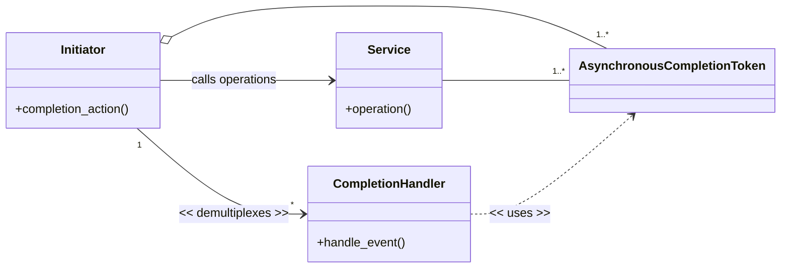
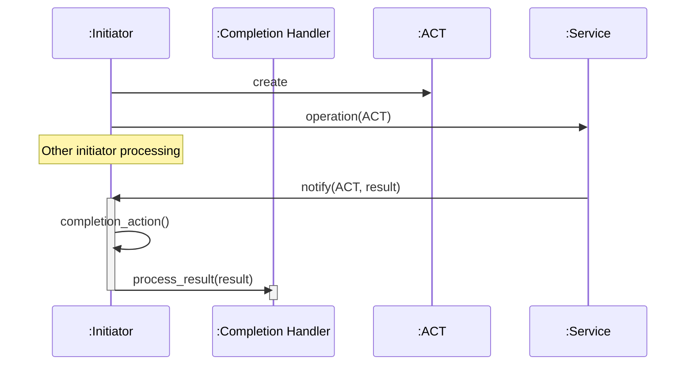
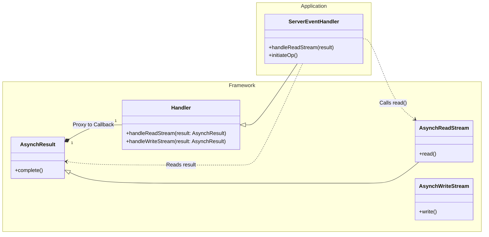
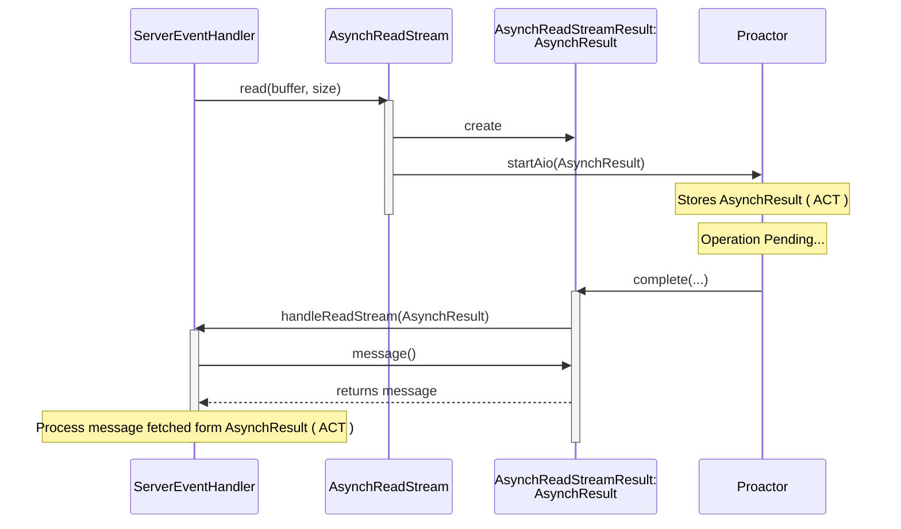

**Table of Contents**
- [Overview](#overview)
- [Asynchronous Completion Token (ACT) pattern](#asynchronous-completion-token-act-pattern)
  - [Background](#background)
  - [Solution](#solution)
  - [Structure](#structure)
    - [Class diagram](#class-diagram)
    - [Dynamic](#dynamic)
- [Simplified version of Implementation](#simplified-version-of-implementation)
  - [Design Choices](#design-choices)
  - [Component Mapping](#component-mapping)
  - [Framework Layer](#framework-layer)
  - [Application Layer](#application-layer)
  - [Class diagram](#class-diagram-1)
  - [Sequence diagram](#sequence-diagram)
  - [Directory and file structure](#directory-and-file-structure)


## Overview

This post explores the **Asynchronous Completion Token** [[POSA2](/references/post-references)] through a **simplified** implementation inspired by the [Adaptive Communication Environment (ACE)](https://www.dre.vanderbilt.edu/~schmidt/ACE.html). 

The goal of this post is to share what I learned while building the simplified implementation.

## Asynchronous Completion Token (ACT) pattern

The **Asynchronous Completion Token (ACT)** [[POSA2](/references/post-references)], also known as *Active Demultiplexing*, lets an application efficiently demultiplex and process the results of asynchronous operations that the application initiated.

### Background
In a multi-threaded system, a client application may invoke operations on services and later receive the results asynchronously via completion events. When a completion event arrives, the client is responsible for demultiplexing it to the correct completion handler so the result can be processed.

To handle this efficiently, three factors matter:
- **No direct dependency on client state**: The service should not need to understand the client’s original context (and often cannot, because the client continues doing other work after initiating the operation).
- **Low communication overhead**: Avoid extra round trips or side channels just to figure out how the client should process a completion.
- **Fast demultiplexing on completion**: When the completion event arrives, the client should be able to quickly route it to the correct handler.

### Solution
Whenever a client (the *initiator*) invokes an asynchronous operation on a service, it sends extra information describing how to handle the service’s response. When the operation completes, that information is returned unchanged, enabling the initiator to demultiplex and process the response efficiently.

In Detail: 
1. A client creates an `Asynchronous Completion Token (ACT)` when it invokes an asynchronous operation on a service.  
  The ACT contains information that uniquely identifies the completion handler responsible for processing the operation’s response.
2. The ACT is passed to the service along with the operation request.
3. The service keeps the ACT without modifying it.
4. When the operation completes, the service responds to the initiator and includes the original ACT.
5. The initiator uses the ACT to identify the correct completion handler and process the response.

 

### Structure
The Asynchronous Completion Token pattern has four participants:
- **Service**: Provides functionality and processes requests asynchronously.
- **Initiator**: Invokes operations on a service asynchronously and demultiplexes the service response to the appropriate handler.
- **Completion Handler**: A function or object that processes the result of a completed asynchronous operation.
- **Asynchronous Completion Token (ACT)**: Contains information that identifies an initiator’s completion handler. It is passed to the service when the initiator requests an asynchronous operation and is returned unchanged when the operation completes, enabling efficient demultiplexing.


#### Class diagram

#### Dynamic



## Simplified version of Implementation


### Design Choices
This version keeps the core architectural ideas from ACE while intentionally skipping production-level complexity. For example, unlike the full ACE implementation which applied Factory and Bridge design patterns to support multiple platforms, this version supports only the POSIX platform and omits all Factory-related structures.

The participants of ACT in this post are implemented as part of a simplified **Proactor** framework, which is covered in [Proactor framework](/design%20pattern%20-%20ace%20framework/post-proactor/).

The following framework is used as infrastructure for this implementation:
- [Reactor framework](/design%20pattern%20-%20ace%20framework/post-reactor/)


### Component Mapping
To implement this pattern, I mapped the ACT pattern components to the following C++ classes and associated OS kernel services:

| Pattern Role | Implementation class / OS kernel service |
| :--- | :--- |
| **Service** | `POSIX.4 Asynchronous I/O` |
| **Initiator** | `AsynchReadStream / AsynchWriteStream` |
| **Completion Handler** | `Handler/ServiceHandler` |
| **Asynchronous Completion Token (ACT)** | `AsynchResult` |


### Framework Layer

The core components of ACT in the Proactor framework are:

-   **Handler**: An abstract base class for application-defined completion event handlers. It defines virtual methods like `handleReadStream` and `handleWriteStream` to process operation completions.
-   **ServiceHandler**: Extends `Handler` to support connection initialization (`open`).
-   **AsynchResult**: Represents the result of an asynchronous operation. It contains the status, bytes transferred, and acts as a carrier for the completion callback to the `Handler`.
-   **AsynchReadStream / AsynchWriteStream**: Factory classes used by applications to initiate asynchronous read and write operations. They register each request with the `Proactor`.
    
### Application Layer

The example application demonstrates a hybrid approach where:
-   **Acceptor**: Uses the **Reactor** pattern to synchronously listen for and accept new TCP connections. Upon acceptance, it creates a `ServerEventHandler` and hands over the new socket to the Proactor framework.
-   **ServerEventHandler**: A concrete `ServiceHandler` that manages the lifecycle of a client connection. It initiates asynchronous reads and writes using `AsynchReadStream` and `AsynchWriteStream`.
  
### Class diagram

The following diagram illustrates the relationship between the participants of the Asynchronous Completion Token pattern and the application classes.
This diagram focuses on the classes involved in transporting the Asynchronous Completion Token.



### Sequence diagram

The sequence below illustrates the lifecycle of the ACT: from passing it during initiation to retrieving it during completion.



### Directory and file structure
Related source files:

```bash
├── applications
│   ├── example_proactor
│   │   ├── Acceptor.cpp
│   │   ├── Acceptor.hpp
│   │   ├── MainClient.cpp
│   │   ├── MainServer.cpp
│   │   ├── ServerEventHandler.cpp
│   │   └── ServerEventHandler.hpp
├── framework
│   ├── proactor
│   │   └── 1_0
│   │       ├── AsynchPseudoTask.cpp
│   │       ├── AsynchPseudoTask.hpp
│   │       ├── AsynchReadStream.cpp
│   │       ├── AsynchReadStream.hpp
│   │       ├── AsynchResult.cpp
│   │       ├── AsynchResult.hpp
│   │       ├── AsynchWriteStream.cpp
│   │       ├── AsynchWriteStream.hpp
│   │       ├── Handler.cpp
│   │       ├── Handler.hpp
│   │       ├── NotifyPipeManager.cpp
│   │       ├── NotifyPipeManager.hpp
│   │       ├── Proactor.cpp
│   │       ├── Proactor.hpp
│   │       ├── ServiceHandler.cpp
│   │       └── ServiceHandler.hpp

```
